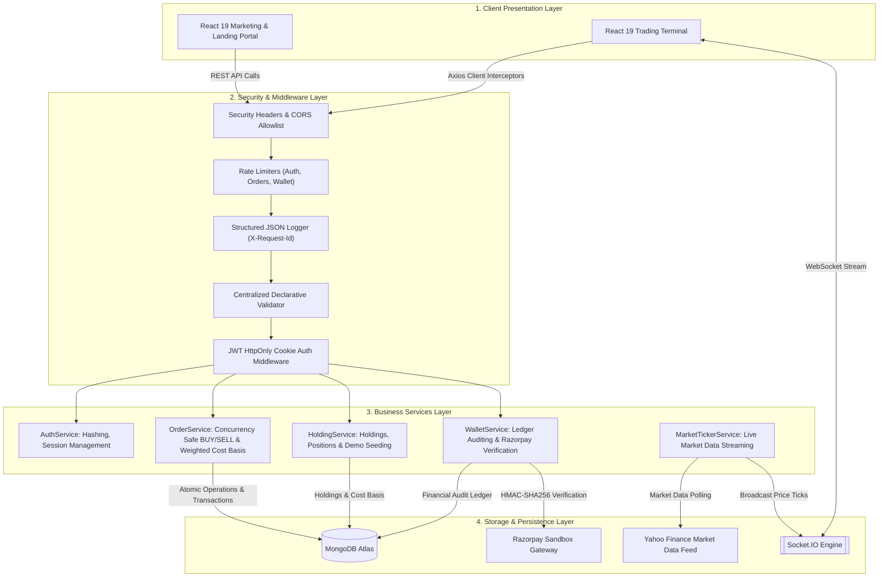
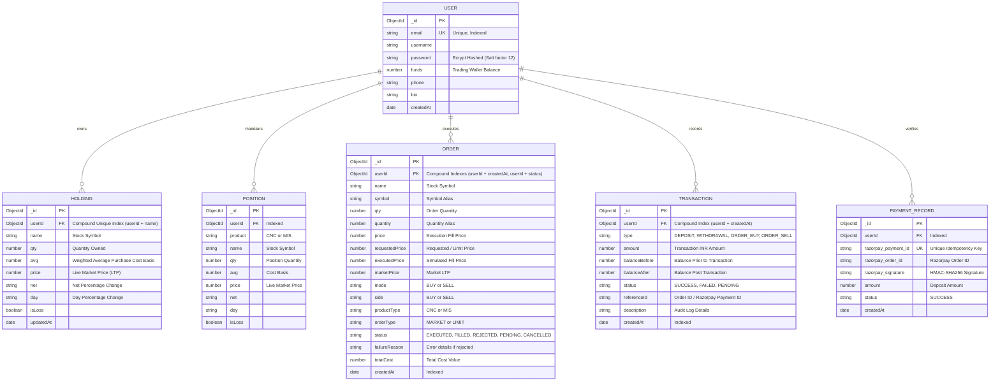

# 📈 PulseTrade — Full-Stack Paper-Trading Platform

> **Full-stack paper-trading platform for simulated stock trading and portfolio management.**

---

### 🛡️ Tech Stack & Badges

[](https://opensource.org/licenses/ISC)
[](https://react.dev/)
[](https://vitejs.dev/)
[](https://nodejs.org/)
[](https://expressjs.com/)
[](https://www.mongodb.com/atlas)
[](https://socket.io/)
[](https://jwt.io/)
[](https://razorpay.com/)
[](https://www.docker.com/)
[](https://github.com/features/actions)
[](https://jestjs.io/)
[](https://swagger.io/)

---

> [!NOTE]
> **Product Disclaimer & Scope**: **PulseTrade** is an educational paper-trading simulator and portfolio management application. It allows users to practice simulated stock trading and track virtual portfolios using market data feeds. It does **not** route live trades to real financial exchanges (such as NSE/BSE) and has no affiliation with Zerodha Broking Ltd. or any registered stock broker.

---

## 🏛️ System Architecture

PulseTrade is structured with a clean, decoupled layered backend architecture:

```
                      React
                        │
                        ▼
                Axios / Socket.IO
                        │
                        ▼
                Express API Server
                        │
            ┌───────────┴───────────┐
            │                       │
       Auth Middleware        Validation
            │                       │
            └───────────┬───────────┘
                        ▼
                   Controllers
                        │
                        ▼
                    Services
                        │
          ┌─────────────┼─────────────┐
          │             │             │
        Users         Orders       Portfolio
          │             │             │
          └─────────────┼─────────────┘
                        ▼
                    MongoDB
                        │
                        ▼
                Transaction Layer
```



---

## 📸 Product Walkthrough & Screenshots

| Trading Terminal & Holdings Analytics | Live Stock Watchlist & Market Depth |
|:---:|:---:|
| <br><sub>*Dynamic portfolio valuation, weighted average cost basis, and P&L charts*</sub> | <br><sub>*Real-time NSE stock ticker via authenticated WebSockets*</sub> |

| Transaction-Safe Order Action Window | Wallet & Razorpay Sandbox Deposit Modal |
|:---:|:---:|
| <br><sub>*Atomic BUY/SELL modal with balance validation*</sub> | <br><sub>*Simulated UPI/Netbanking deposits with HMAC-SHA256 signature auditing*</sub> |

| OpenAPI 3.0 Interactive Swagger UI | System Diagnostics & Health Status |
|:---:|:---:|
| <br><sub>*Interactive API testing at `/api-docs`*</sub> | <br><sub>*System uptime, database latency & memory stats at `/health`*</sub> |

---

## ⚡ Quick Demo & Test Credentials

Experience PulseTrade with pre-configured sandbox credentials or instant demo data seeding:

### Option A: One-Click Demo Seeding
1. Register or Log in to the [Trading Terminal](http://localhost:5173).
2. Navigate to **Holdings** and click **"Load Demo Portfolio"**.
3. Instantly loads a **₹50,000 simulated balance** and **12 active NSE equity holdings** with real-time price tickers.

### Option B: Test Credentials
| Role | Email | Password | Initial Balance |
|---|---|---|:---:|
| **Demo Trader** | `demo@pulsetrade.com` | `DemoTrader123!` | ₹50,000 (Simulated) |

### Option C: Simulated Razorpay Sandbox Deposit
1. Go to the **Funds** tab and click **"+ Add Funds"**.
2. Enter any amount (e.g. ₹10,000).
3. In the Razorpay Checkout popup, select **Netbanking (SBI / HDFC)** or **UPI** to simulate verified deposits without real money.

---

## 🔑 Core Engineering & Business Logic Gaps Addressed

### 1. Server-Enforced Order Validation & ACID Transactions (GAP 1)
- **ACID MongoDB Session Transactions**: BUY and SELL operations run in multi-document MongoDB transactions (`mongoose.startSession()`), guaranteeing all-or-nothing consistency across `UserModel` (funds), `HoldingModel` (portfolio), `OrderModel` (audit trail), and `TransactionModel` (financial ledger).
- **Zero Compensation Lag**: Eliminates manual compensation rollbacks; if any downstream document write fails, the database transaction is automatically aborted.
- **BUY Validation**: The backend independently validates `available balance >= (qty * executedPrice)`. If insufficient, a `REJECTED` order is recorded in the audit trail without touching funds or holdings.
- **SELL Validation**: The backend validates `shares owned >= requested quantity`. If unowned or oversold, a `REJECTED` order is recorded immediately.

### 2. Concurrency Safety & Multi-Document Atomicity (GAP 2)
- Prevents double-spending and overselling under concurrent requests (e.g. concurrent BUY orders or parallel withdrawals) via atomic conditional writes (`{ _id: userId, funds: { $gte: totalCost } }` and `{ userId, name, qty: { $gte: qty } }`) executed within database transactions.

### 3. Server-Authoritative Market Pricing & Honest Limit Orders (GAP 3 & 4)
- **Authoritative Market Pricing**: Execution prices are strictly calculated server-side from live market feeds, never trusting client-supplied execution prices.
- **Price Model Fields**: Distinguishes `requestedPrice` (client target price), `marketPrice` (server LTP), and `executedPrice` (actual simulated fill price).
- **Honest LIMIT Order Semantics**:
  - `MARKET`: Fills immediately at current server market price.
  - `LIMIT BUY`: Only fills if `serverMarketPrice <= requestedPrice`; otherwise rejected with clear price feedback.
  - `LIMIT SELL`: Only fills if `serverMarketPrice >= requestedPrice`; otherwise rejected with clear price feedback.

### 4. Hardened Payment Gateway & Strict Pending Validation (GAP 5)
- **Pre-Created Pending Order Guarantee**: Payment verification strictly requires a pre-existing server-created record with status `PENDING` belonging to `req.userId` with exact matching amount and valid HMAC-SHA256 signature.
- **Atomic Credit & Ledger**: Wallet balance increments and ledger write occur within a single database transaction, preventing balance/ledger divergence.
- **Idempotency**: Prevents double-crediting on network retries or replay attacks.

### 5. Layered Security & Centralized Validation (GAP 6 & 7)
- **Zero-Token Exposure**: Strict `HttpOnly: true` cookies with zero JWT tokens exposed in JSON payloads.
- **Brute-Force Rate Limiting**: Dedicated auth rate limiter (10 attempts / 15 mins) plus global, order, and wallet rate limiters.
- **Centralized Validation Middleware**: Validates inputs (emails, password strength, positive integers for quantities, valid order modes/types) before reaching controllers.
- **Generic Auth Errors**: Both unknown users and bad passwords return `"Incorrect email address or password"` to prevent user enumeration.

### 6. Clean Architectural Separation (GAP 8)
- Strict separation of concerns across every domain:
  `Route -> Middleware -> Controller -> Service -> Model`
- Controllers handle HTTP transport, while `AuthService`, `OrderService`, `HoldingService`, and `WalletService` encapsulate business logic.

### 7. Strict User Isolation & Access Control (GAP 9)
- All authenticated endpoints (`/allOrders`, `/allHoldings`, `/allPositions`, `/user/funds`, `/user/transactions`, `/verify-razorpay-payment`) are strictly scoped to the authenticated `req.userId`.
- Rigorously verified through integration tests ensuring User A can never read or mutate User B's portfolio or order records.

### 8. Transparent Market Data Presentation & Diagnostics (GAP 10, 11 & 12)
- Accurately presented as a paper-trading platform that simulates trading using market data polled from Yahoo Finance, supplemented with synthetic micro-ticks outside market hours.
- Structured error middleware mapping status codes (400, 401, 403, 404, 409, 429, 500) and JSON logging with correlation IDs (`X-Request-Id`).

---

## 🗄️ Database Entity-Relationship (ER) Diagram



---

## 📡 API Reference (`/api/v1`)

Access the interactive **Swagger UI** documentation at **[`http://localhost:3000/api-docs`](http://localhost:3000/api-docs)**.

| HTTP Method | Version 1 Path | Legacy Alias | Description | Auth Required | Rate Limited |
|:---:|---|---|---|:---:|:---:|
| `GET` | `/api/v1/health` | `/health` | System diagnostics, uptime & DB ping latency | ❌ | ❌ |
| `GET` | `/api-docs` | `/api-docs` | Interactive OpenAPI 3.0 Swagger UI | ❌ | ❌ |
| `POST` | `/api/v1/auth/signup` | `/signup` | User account registration (sets HttpOnly cookie) | ❌ | 🔒 (10 / 15m) |
| `POST` | `/api/v1/auth/login` | `/login` | User login & HttpOnly session cookie issuance | ❌ | 🔒 (10 / 15m) |
| `POST` | `/api/v1/auth/logout` | `/logout` | User logout & cookie clearance | ❌ | ❌ |
| `POST` | `/api/v1/auth/` | `/` | User session verification | 🔑 | ❌ |
| `GET` | `/api/v1/orders/allOrders` | `/allOrders` | Retrieve user orders with pagination, filtering & sorting | 🔑 | ❌ |
| `POST` | `/api/v1/orders/newOrders` | `/newOrders` | Submit transaction-safe BUY / SELL stock order | 🔑 | 🔒 (30 / 1m) |
| `GET` | `/api/v1/holdings/allHoldings` | `/allHoldings` | Retrieve user stock holdings & cost basis | 🔑 | ❌ |
| `GET` | `/api/v1/holdings/allPositions` | `/allPositions` | Retrieve user active intraday positions | 🔑 | ❌ |
| `POST` | `/api/v1/holdings/seedDemoData` | `/seedDemoData` | Seed ₹50,000 demo portfolio with 12 stocks | 🔑 | ❌ |
| `DELETE` | `/api/v1/holdings/resetPortfolio` | `/resetPortfolio` | Reset portfolio, orders & wallet to clean state | 🔑 | ❌ |
| `GET` | `/api/v1/wallet/user/funds` | `/user/funds` | Fetch available cash margins & wallet balance | 🔑 | ❌ |
| `POST` | `/api/v1/wallet/user/funds` | `/user/funds` | Deposit or withdraw funds from wallet | 🔑 | 🔒 (15 / 1m) |
| `POST` | `/api/v1/wallet/create-razorpay-order` | `/create-razorpay-order` | Create Razorpay Sandbox test order | 🔑 | 🔒 (15 / 1m) |
| `POST` | `/api/v1/wallet/verify-razorpay-payment` | `/verify-razorpay-payment` | Verify HMAC-SHA256 signature with idempotency | 🔑 | 🔒 (15 / 1m) |
| `GET` | `/api/v1/wallet/user/transactions` | `/user/transactions` | Retrieve wallet audit transaction ledger | 🔑 | ❌ |

---

## 🧪 Test Coverage & Verification

PulseTrade features a real integration test suite with Jest and Supertest running against MongoDB:

```bash
cd Backend
npm test
```

### Integration Test Breakdown

| Test Category | Critical Business Logic Verified | Status |
|---|---|:---:|
| **Health & Observability** | Health endpoint (`/health`), OpenAPI JSON, Swagger UI, `X-Request-Id` correlation tracking | ✅ Passed |
| **Authentication & Security** | Signup validation, duplicate email rejection, HttpOnly cookies, zero-token JSON, generic login errors | ✅ Passed |
| **BUY Order ACID Engine** | Multi-document session transactions, insufficient funds rejection (`status: REJECTED`), unfillable LIMIT BUY rejection, fillable LIMIT BUY execution, weighted cost basis math | ✅ Passed |
| **SELL Order ACID Engine** | Multi-document session transactions, selling unowned stock rejection, overselling rejection, unfillable LIMIT SELL rejection, proceeds crediting, holding removal on 0 qty | ✅ Passed |
| **Portfolio Math** | Multi-purchase weighted average price calculation, partial sell cost basis preservation | ✅ Passed |
| **User Isolation** | User A cannot see User B's orders, holdings, positions, funds, or wallet transactions; cross-user payment verification blocked | ✅ Passed |
| **Pagination & Filtering** | Pagination metadata (`page`, `limit`, `totalPages`), mode filter (`BUY`/`SELL`), symbol search, price/date sorting | ✅ Passed |
| **Razorpay Gateway & Ledger** | Reject missing pending records, amount mismatch rejection, signature forgery rejection, atomic credit + ledger, idempotency / replay prevention | ✅ Passed |
| **Wallet Concurrency & Withdraw** | Atomic ADD/WITHDRAW session transactions, overdrawing prevention, non-negative balance guarantees | ✅ Passed |
| **Backward Compatibility** | Legacy root routes (`/allHoldings`, `/user/funds`, `/allOrders`, `/newOrders`) | ✅ Passed |

---

## 💻 Local Development Setup

### 1. Prerequisites
- [Node.js](https://nodejs.org/) (v18+)
- [Git](https://git-scm.com/)
- [MongoDB Atlas](https://www.mongodb.com/atlas) account (or local MongoDB)

### 2. Clone the Repository
```bash
git clone https://github.com/Sekhar01807/Trading-platform.git
cd Trading-platform
```

### 3. Configure Environment Variables
Copy `.env.example` in `Backend/` to `.env`:
```env
PORT=3000
NODE_ENV=development
ATLASDB_URL=mongodb+srv://<user>:<password>@cluster.mongodb.net/pulsetrade
TOKEN_KEY=your_secure_jwt_secret_key_here
RAZORPAY_KEY_ID=rzp_test_your_key_id
RAZORPAY_KEY_SECRET=your_razorpay_secret
FRONTEND_URL=http://localhost:5174
DASHBOARD_URL=http://localhost:5173
```

### 4. Run Services

#### Start Backend API & WebSocket Server:
```bash
cd Backend
npm install
npm run dev
```
- API Health Check: `http://localhost:3000/health`
- Interactive Swagger UI: `http://localhost:3000/api-docs`

#### Start Dashboard Trading Terminal:
```bash
cd dashboard
npm install
npm run dev
```
- Accessible at `http://localhost:5173`

#### Start Marketing Portal:
```bash
cd frontend
npm install
npm run dev
```
- Accessible at `http://localhost:5174`

---

## 📄 License

This project is licensed under the [ISC License](LICENSE).
