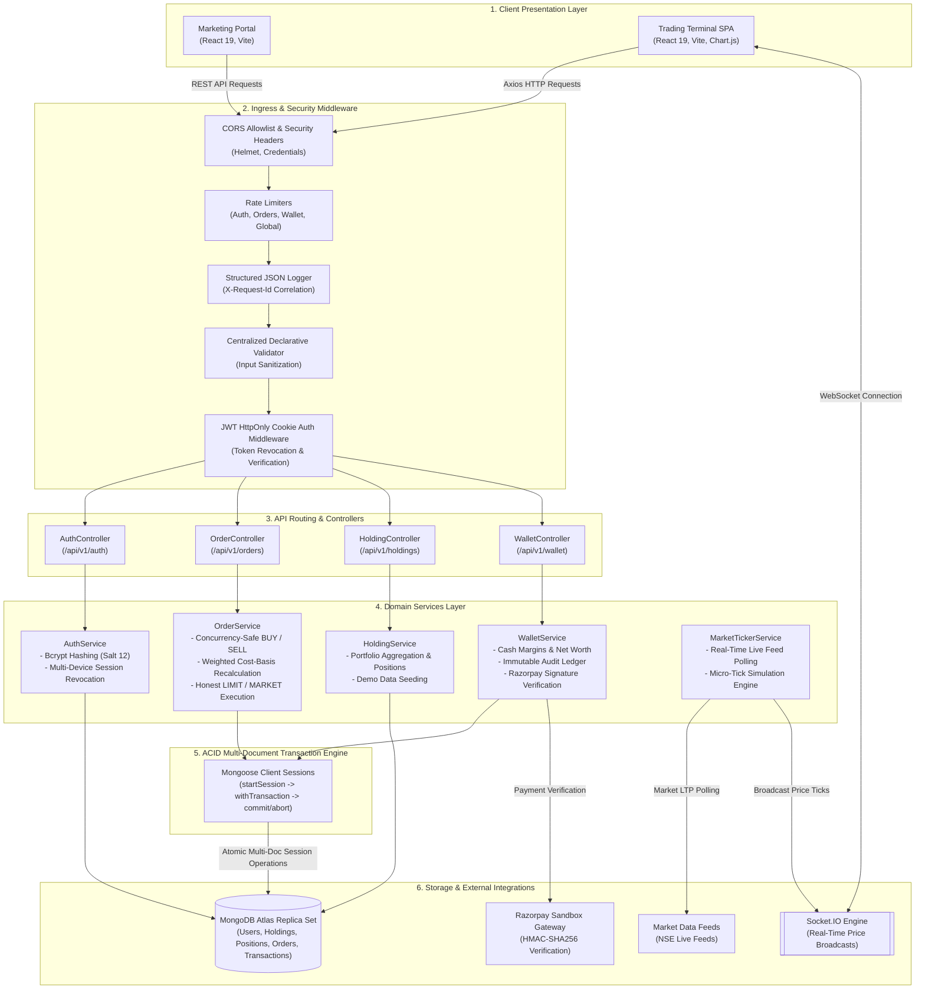
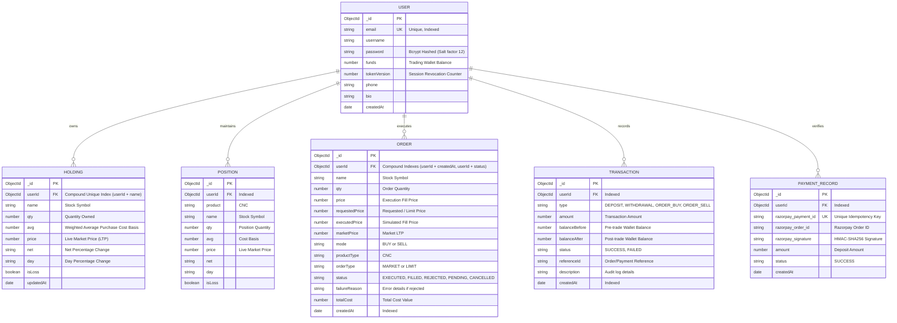
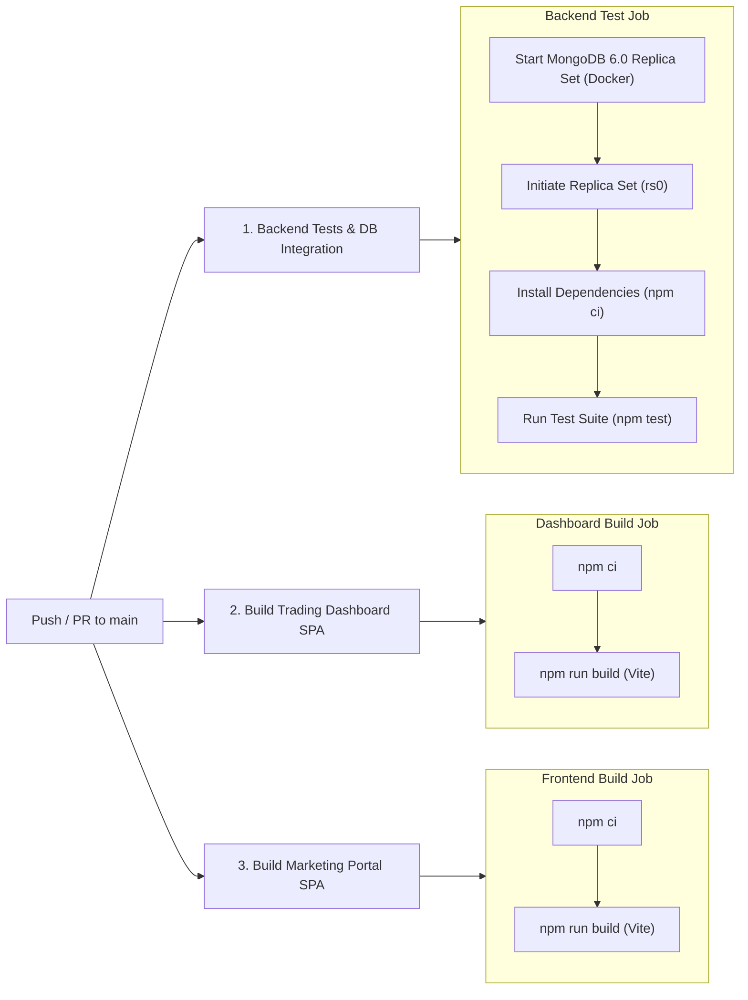

# PulseTrade — Full-Stack Paper-Trading Platform

> **Enterprise-grade full-stack paper-trading platform for simulated equity trading, real-time market data streaming, atomic financial ledgers, and portfolio management.**

---

### Tech Stack & Badges

[](https://opensource.org/licenses/ISC)
[](https://react.dev/)
[](https://vitejs.dev/)
[](https://nodejs.org/)
[](https://expressjs.com/)
[](https://www.mongodb.com/atlas)
[](https://socket.io/)
[](https://jwt.io/)
[](https://razorpay.com/)
[](https://www.docker.com/)
[](https://github.com/features/actions)
[](https://jestjs.io/)
[](https://swagger.io/)

---

### Live Production Deployments

| Component | Production URL | Description |
|:---|:---|:---|
| **Trading Terminal** | [https://dashboard-lilac-nu-83.vercel.app](https://dashboard-lilac-nu-83.vercel.app) | React 19 / Vite SPA trading terminal for simulated portfolio management |
| **Marketing Portal** | [https://frontend-seven-phi-94.vercel.app](https://frontend-seven-phi-94.vercel.app) | Landing page, feature walkthroughs, and onboarding portal |
| **Backend API** | [https://pulsetrade-zygv.onrender.com](https://pulsetrade-zygv.onrender.com) | Express 5 REST API & Socket.IO real-time price streaming engine |
| **Swagger UI Docs** | [https://pulsetrade-zygv.onrender.com/api-docs](https://pulsetrade-zygv.onrender.com/api-docs) | Interactive OpenAPI 3.0 API documentation & test runner |
| **Health Diagnostics** | [https://pulsetrade-zygv.onrender.com/health](https://pulsetrade-zygv.onrender.com/health) | Live service status, database connectivity & memory metrics |

---

> [!NOTE]
> **Product Disclaimer & Scope**: **PulseTrade** is an educational paper-trading simulator and portfolio management application. It allows users to practice simulated equity delivery (CNC) trading and track virtual portfolios using market data feeds. It does **not** route live trades to real financial exchanges (such as NSE/BSE) and has no affiliation with Zerodha Broking Ltd. or any registered stock broker.

---

## System Architecture

PulseTrade is designed with a decoupled multi-tier architecture ensuring fail-closed operations, financial consistency, and sub-millisecond local latency:



---

## Quick Demo & Getting Started

Experience PulseTrade with instant registration and demo portfolio seeding:

### 1. Instant Demo Portfolio Seeding
1. Register or Log in to the [Trading Terminal](https://dashboard-lilac-nu-83.vercel.app) (or `http://localhost:5173` locally).
2. Navigate to **Holdings** and click **"Load Demo Portfolio"**.
3. Instantly loads a **₹50,000 simulated balance** and **12 active NSE equity holdings** with real-time price tickers.

### 2. Simulated Razorpay Sandbox Deposit
1. Go to the **Funds** tab and click **"+ Add Funds"**.
2. Enter any deposit amount (e.g. ₹10,000).
3. In the Razorpay Checkout popup, select **Netbanking (SBI / HDFC)** or **UPI** to simulate verified deposits without real money.

---

## Core Engineering & Business Logic Architecture

### 1. Fail-Closed ACID MongoDB Transactions
- **Multi-Document Session Transactions**: BUY and SELL operations run in strict MongoDB session transactions (`mongoose.startSession()`), guaranteeing all-or-nothing consistency across `UserModel` (funds), `HoldingModel` (portfolio), `OrderModel` (audit trail), and `TransactionModel` (financial ledger).
- **Strict Fail-Closed Architecture**: If a database session cannot be acquired or if any document write fails, operations fail closed immediately with zero silent downgrade to non-transactional execution.
- **BUY Validation**: The backend independently validates `available balance >= (qty * executedPrice)`. If insufficient, a `REJECTED` order is recorded in the audit trail without touching funds or holdings.
- **SELL Validation**: The backend validates `shares owned >= requested quantity`. If unowned or oversold, a `REJECTED` order is recorded immediately.

### 2. Concurrency Safety & Multi-Document Atomicity
- Prevents double-spending and overselling under concurrent requests (e.g. concurrent BUY orders or parallel withdrawals) via atomic conditional writes (`{ _id: userId, funds: { $gte: totalCost } }` and `{ userId, name, qty: { $gte: qty } }`) executed within database transactions.

### 3. Server-Authoritative Market Pricing & Honest Limit Orders
- **Authoritative Market Pricing**: Execution prices are strictly calculated server-side from live market feeds and predefined tradable instruments (`TRADABLE_SYMBOLS`), never trusting client-supplied execution prices.
- **Tradable Symbols Whitelist**: Unregistered instruments or unsupported symbols are rejected immediately without fallback to client requested prices.
- **Price Model Fields**: Distinguishes `requestedPrice` (client target price), `marketPrice` (server LTP), and `executedPrice` (actual simulated fill price).
- **Honest LIMIT Order Semantics**:
  - `MARKET`: Fills immediately at current server market price.
  - `LIMIT BUY`: Only fills if `serverMarketPrice <= requestedPrice`; otherwise rejected with clear price feedback.
  - `LIMIT SELL`: Only fills if `serverMarketPrice >= requestedPrice`; otherwise rejected with clear price feedback.

### 4. Hardened Payment Gateway & Strict Pending Validation
- **Pre-Created Pending Order Guarantee**: Payment verification strictly requires a pre-existing server-created record with status `PENDING` belonging to `req.userId` with exact matching amount and valid HMAC-SHA256 signature.
- **Production Fail-Closed Configuration**: In production, missing `RAZORPAY_KEY_ID` or `RAZORPAY_KEY_SECRET` immediately fails closed with a 500 error rather than entering simulation mode.
- **Atomic Credit & Ledger**: Wallet balance increments and ledger write occur within a single database transaction, preventing balance/ledger divergence.
- **Idempotency**: Prevents double-crediting on network retries or replay attacks.

### 5. Multi-Device Session Invalidation & Rate Limiting Architecture
- **Token Versioning**: `UserModel` maintains `tokenVersion`, embedded in signed JWT payloads.
- **Session Revocation**: Calling `POST /api/v1/auth/logout-all` increments `tokenVersion`, instantly invalidating all existing JWT sessions across all devices.
- **Zero-Token Exposure**: Strict `HttpOnly: true` cookies with zero JWT tokens exposed in JSON payloads.
- **Brute-Force & Flood Protection**: Dedicated sliding-window rate limiters for auth (10 req / 15m), orders (30 req / 1m), wallet operations (15 req / 1m), and global API (300 req / 15m).
- **Generic Auth Errors**: Both unknown users and bad passwords return `"Incorrect email address or password"` to prevent user enumeration.

### 6. Clean Architectural Separation
- Strict separation of concerns across every domain:
  `Route -> Middleware -> Controller -> Service -> Model`
- Controllers handle HTTP transport, while `AuthService`, `OrderService`, `HoldingService`, and `WalletService` encapsulate business logic.

### 7. Strict User Isolation & Access Control
- All authenticated endpoints (`/allOrders`, `/allHoldings`, `/allPositions`, `/user/funds`, `/user/transactions`, `/verify-razorpay-payment`) are strictly scoped to the authenticated `req.userId`.
- Rigorously verified through integration tests ensuring User A can never read or mutate User B's portfolio or order records.

### 8. Financial Arithmetic & Monetary Precision
- Dedicated currency utility (`util/currency.js`) provides standard 2-decimal rounded currency arithmetic and integer-paise conversion functions.
- All wallet balances, order costs, and ledger records maintain exact mathematical consistency without race conditions.

### 9. Real-Time Market Data & WebSocket Subscriptions
- `MarketTickerService` streams live prices for 12 NSE stocks via Socket.IO.
- Authenticated websocket handshake with user-specific notification rooms (`user_${userId}`).
- Dynamic symbol subscription (`subscribe` / `unsubscribe` events) and resilient polling with synthetic micro-tick simulation outside market hours.

---

## Database Entity-Relationship (ER) Diagram



---

## API Reference (`/api/v1`)

Access the interactive **Swagger UI** documentation at **[`https://pulsetrade-zygv.onrender.com/api-docs`](https://pulsetrade-zygv.onrender.com/api-docs)** (or `http://localhost:3000/api-docs` locally).

| HTTP Method | Endpoint Path | Description | Auth Required | Rate Limited |
|:---:|---|---|:---:|:---:|
| `GET` | `/api/v1/health` | System diagnostics, uptime & DB ping latency | No | No |
| `GET` | `/api-docs` | Interactive OpenAPI 3.0 Swagger UI | No | No |
| `POST` | `/api/v1/auth/signup` | User account registration (sets HttpOnly cookie) | No | Yes (10 / 15m) |
| `POST` | `/api/v1/auth/login` | User login & HttpOnly session cookie issuance | No | Yes (10 / 15m) |
| `POST` | `/api/v1/auth/logout` | User logout & cookie clearance | No | No |
| `POST` | `/api/v1/auth/logout-all` | Revoke all active sessions across all devices | Yes | No |
| `POST` | `/api/v1/auth/updateProfile` | Update user profile bio & phone | Yes | No |
| `GET` | `/api/v1/orders/allOrders` | Retrieve user orders with pagination, filtering & sorting | Yes | No |
| `POST` | `/api/v1/orders/newOrders` | Submit transaction-safe BUY / SELL stock order | Yes | Yes (30 / 1m) |
| `GET` | `/api/v1/holdings/allHoldings` | Retrieve user stock holdings & cost basis | Yes | No |
| `GET` | `/api/v1/holdings/allPositions` | Retrieve user active positions | Yes | No |
| `POST` | `/api/v1/holdings/seedDemoData` | Seed ₹50,000 demo portfolio with 12 stocks (Dev only) | Yes | No |
| `DELETE` | `/api/v1/holdings/resetPortfolio` | Reset portfolio, orders & wallet to clean state (Dev only) | Yes | No |
| `GET` | `/api/v1/wallet/user/funds` | Fetch available cash margins & wallet balance | Yes | No |
| `POST` | `/api/v1/wallet/user/funds` | Deposit or withdraw funds from wallet | Yes | Yes (15 / 1m) |
| `POST` | `/api/v1/wallet/create-razorpay-order` | Create Razorpay Sandbox test order | Yes | Yes (15 / 1m) |
| `POST` | `/api/v1/wallet/verify-razorpay-payment` | Verify HMAC-SHA256 signature with idempotency | Yes | Yes (15 / 1m) |
| `GET` | `/api/v1/wallet/user/transactions` | Retrieve wallet audit transaction ledger | Yes | No |

---

## Test Coverage & Verification

PulseTrade features a dual-layer automated test suite (**API integration** + **Service-level unit/transaction rollback tests**) with Jest and Supertest running against MongoDB:

```bash
cd Backend
npm test
```

### Automated Test Breakdown (17 Comprehensive Test Suites)

| Test Suite File | Test Suite Name | Critical Business Logic & Invariants Verified | Status |
|:---|:---|---|:---:|
| `Backend/tests/api.test.js` | **1. System Health & Observability** | Health endpoint (`/health`), API mirror (`/api/v1/health`), OpenAPI JSON, Swagger UI, `X-Request-Id` correlation tracking | Passed |
| `Backend/tests/api.test.js` | **2. Authentication & Security** | Signup validation, duplicate email rejection, HttpOnly cookies, zero-token JSON, generic login errors, `tokenVersion` multi-device session revocation | Passed |
| `Backend/tests/api.test.js` | **3. Wallet & Margin Operations** | Deposit credit, available cash calculation, excessive withdrawal rejection, atomic ledger entry creation | Passed |
| `Backend/tests/api.test.js` | **4. BUY Orders & Validation** | Input validation (negative/fractional qty, non-CNC product), insufficient balance rejection with `REJECTED` audit, honest LIMIT orders, MARKET BUY execution | Passed |
| `Backend/tests/api.test.js` | **5. Portfolio Cost Basis Math** | Recalculation of weighted average purchase cost basis (`avg`) on sequential stock purchases | Passed |
| `Backend/tests/api.test.js` | **6. SELL Orders & Concurrency** | Unowned stock rejection, overselling rejection, unfillable LIMIT SELL rejection, partial SELL cost-basis preservation, complete SELL holding deletion (qty=0) | Passed |
| `Backend/tests/api.test.js` | **7. User Isolation & Access Control** | User A cannot view or mutate User B's orders, holdings, positions, funds, or wallet transactions | Passed |
| `Backend/tests/api.test.js` | **8. Orders Pagination & Filtering** | Pagination metadata (`page`, `limit`, `totalOrders`), mode filter (`BUY`/`SELL`), date/symbol sorting | Passed |
| `Backend/tests/api.test.js` | **9. Razorpay Security & Verification** | Server-side pending order check, cross-user order rejection, amount mismatch detection, tampered signature failure, valid HMAC-SHA256 credit, idempotent replay attack protection | Passed |
| `Backend/tests/api.test.js` | **10. Compatibility & Ledger Queries** | Root alias routes (`/allHoldings`, `/user/funds`), paginated financial ledger queries (`/user/transactions`) | Passed |
| `Backend/tests/api.test.js` | **11. ACID Rollback Verification** | Failure injection during BUY, SELL, and Wallet operations; verifies 100% atomic rollbacks without state leaks | Passed |
| `Backend/tests/services.test.js` | **1. OrderService Input Guardrails** | Empty/invalid symbols, unsupported tradables, non-positive or non-integer quantities, non-CNC products | Passed |
| `Backend/tests/services.test.js` | **2. OrderService BUY Execution** | Insufficient balance failure, LIMIT BUY market price comparisons, MARKET BUY balance deduction & holding creation | Passed |
| `Backend/tests/services.test.js` | **3. OrderService SELL Execution** | Zero-share rejection, oversell rejection, LIMIT SELL price checks, partial vs complete sell holding cleanup | Passed |
| `Backend/tests/services.test.js` | **4. Transaction Failure Semantics** | Simulated crash during holding creation, ledger creation, and user funds updates with strict session aborts | Passed |
| `Backend/tests/services.test.js` | **5. WalletService Funds & Ledger** | Financial summary arithmetic (`availableCash`, `spentOnHoldings`, `totalNetWorth`), invalid input handling, ledger rollback | Passed |
| `Backend/tests/services.test.js` | **6. Payment Verification & HMAC** | Missing parameter validation, constant-time HMAC check (`timingSafeEqual`), replay prevention, ledger writing | Passed |

---

## CI/CD Pipeline (GitHub Actions)

PulseTrade includes a continuous integration workflow ([`.github/workflows/ci.yml`](.github/workflows/ci.yml)) executing on every push and pull request to `main`:



---

## Production Docker Deployment

PulseTrade includes a production-hardened multi-stage Docker containerization setup:

- **Backend**: Lightweight Node 20 LTS runtime installing only production dependencies (`npm ci --omit=dev`), executing under a non-root user (`USER node`).
- **Dashboard & Frontend**: Multi-stage builds compiling static production bundles via Vite (`npm run build`), served through high-performance `nginx:alpine` containers with SPA routing fallbacks, gzip compression, and caching headers.

### Start with Docker Compose:
```bash
docker-compose up --build -d
```

- **Backend API**: `http://localhost:3000`
- **Dashboard Terminal**: `http://localhost:5173`
- **Marketing Frontend**: `http://localhost:5174`

---

## Local Development Setup

### 1. Prerequisites
- [Node.js](https://nodejs.org/) (v20+ LTS)
- [Git](https://git-scm.com/)
- **MongoDB Database**: Either **[MongoDB Atlas](https://www.mongodb.com/atlas)** (Recommended — Replica Sets are enabled by default) OR a **Local MongoDB Replica Set** (Required for multi-document ACID transactions).

> [!IMPORTANT]
> **MongoDB Replica Set Requirement**:
> PulseTrade uses MongoDB multi-document ACID transactions (`session.startTransaction()`) in `OrderService` and `WalletService` to guarantee strict balance and inventory consistency without race conditions.
>
> Transactions **require a Replica Set**. If running MongoDB locally on a standalone instance (`mongod`), transactions will fail with `Transaction numbers are only allowed on a replica set member or mongos`.
>
> **Quick Local Replica Set Setup (Choose one)**:
> 1. **MongoDB Atlas (Easiest)**: Create a free tier M0 cluster on [MongoDB Atlas](https://www.mongodb.com/atlas) — it runs as a 3-node replica set automatically.
> 2. **Docker One-Liner**:
>    ```bash
>    docker run -d --name pulsetrade-mongo -p 27017:27017 mongo:7.0 --replSet rs0
>    docker exec -it pulsetrade-mongo mongosh --eval "rs.initiate({_id:'rs0',members:[{_id:0,host:'localhost:27017'}]})"
>    ```
>    Connection URL: `mongodb://localhost:27017/pulsetrade?replicaSet=rs0&directConnection=true`
> 3. **Native Local `mongod`**:
>    Start `mongod` with `--replSet rs0` and run `rs.initiate()` in `mongosh`.

### 2. Clone the Repository
```bash
git clone https://github.com/Sekhar01807/Trading-platform.git
cd Trading-platform
```

### 3. Configure Environment Variables

#### A. Backend (`Backend/.env`)
```env
PORT=3000
NODE_ENV=development
# Atlas URI or Local Replica Set URI:
ATLASDB_URL=mongodb+srv://<user>:<password>@cluster.mongodb.net/pulsetrade
# Or Local: mongodb://localhost:27017/pulsetrade?replicaSet=rs0&directConnection=true
TOKEN_KEY=your_secure_jwt_secret_key_here
RAZORPAY_KEY_ID=rzp_test_your_key_id
RAZORPAY_KEY_SECRET=your_razorpay_secret
FRONTEND_URL=http://localhost:5174
DASHBOARD_URL=http://localhost:5173
```

#### B. Trading Dashboard (`dashboard/.env`)
```env
VITE_API_URL=http://localhost:3000
VITE_LANDING_URL=http://localhost:5174
```

#### C. Marketing Portal (`frontend/.env`)
```env
VITE_API_URL=http://localhost:3000
VITE_DASHBOARD_URL=http://localhost:5173
```

### 4. Run Services Locally

#### Start Backend API & WebSocket Server:
```bash
cd Backend
npm ci
npm run dev
```
- API Health Check: `http://localhost:3000/health`
- Interactive Swagger UI: `http://localhost:3000/api-docs`

#### Start Dashboard Trading Terminal:
```bash
cd dashboard
npm ci
npm run dev
```
- Accessible at `http://localhost:5173`

#### Start Marketing Portal:
```bash
cd frontend
npm ci
npm run dev
```
- Accessible at `http://localhost:5174`

---

## License

This project is licensed under the [ISC License](LICENSE).
