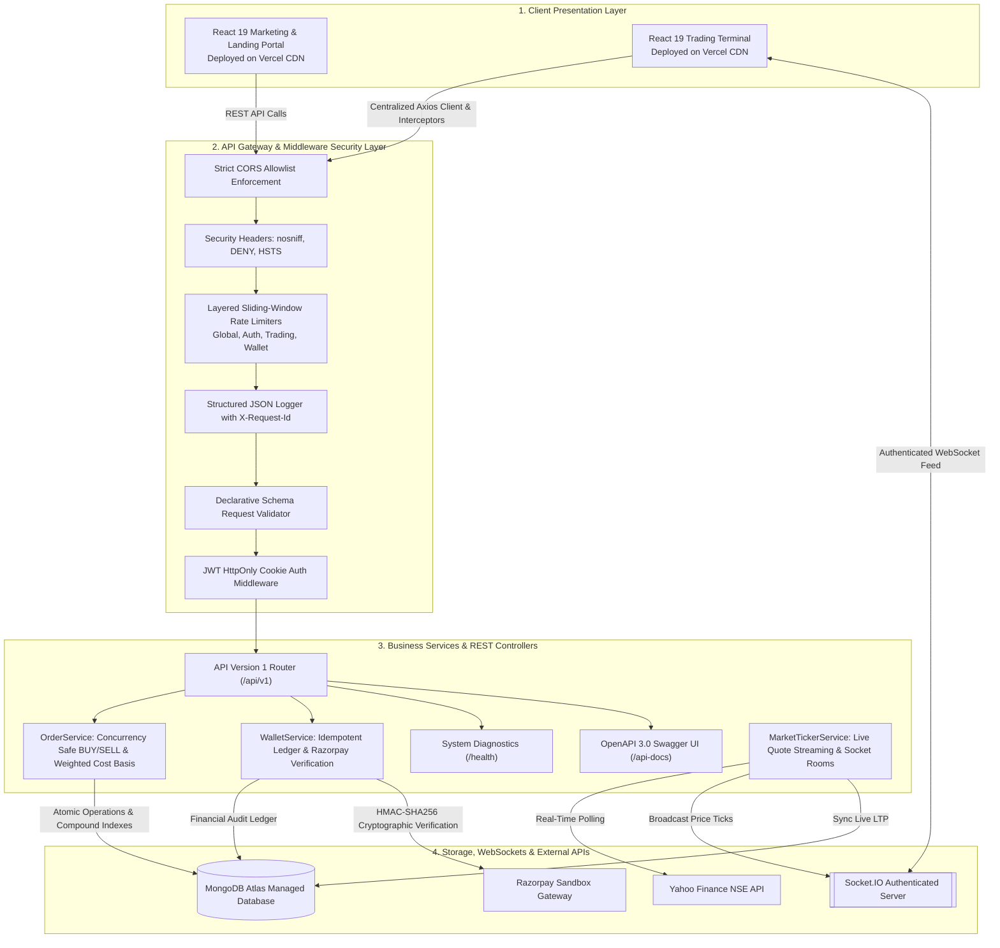
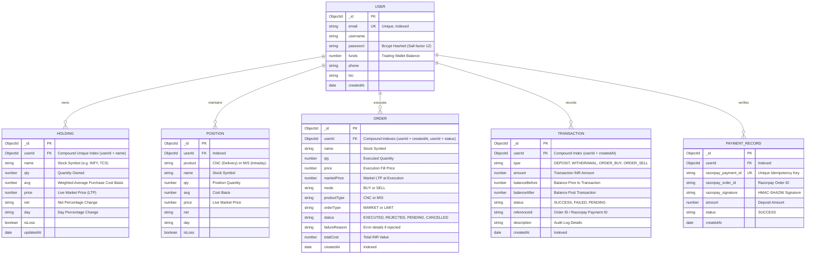

# 📈 PulseTrade — Enterprise Stock Trading Platform

A modern full-stack stock trading terminal, portfolio management system, and paper-trading sandbox built with **Node.js, Express, React 19, WebSockets (Socket.io), MongoDB Atlas, Razorpay Gateway Sandbox, and Docker**.

---

### 🛡️ Tech Stack & Build Badges

[](https://opensource.org/licenses/ISC)
[](https://react.dev/)
[](https://vitejs.dev/)
[](https://nodejs.org/)
[](https://expressjs.com/)
[](https://www.mongodb.com/atlas)
[](https://socket.io/)
[](https://jwt.io/)
[](https://razorpay.com/)
[](https://www.docker.com/)
[](https://github.com/features/actions)
[](https://jestjs.io/)
[](https://swagger.io/)
[](https://vercel.com/)
[](https://render.com/)

---

> [!NOTE]
> **Product Disclaimer**: **PulseTrade** is an independent, open-source educational stock trading simulator and paper-trading portfolio management application. It is designed for portfolio demonstration, algorithmic testing, and learning. It has **no affiliation with Zerodha Broking Ltd.** or any SEBI-registered stock brokerage.

---

## 📸 Product Walkthrough & Screenshots

*(Screenshots can be placed in this section to demonstrate user workflows)*

| Trading Terminal & Holdings Analytics | Live Stock Watchlist & Market Depth |
|:---:|:---:|
| <br><sub>*Dynamic portfolio valuation, weighted average cost basis, and P&L charts*</sub> | <br><sub>*Real-time NSE stock ticker via authenticated WebSockets*</sub> |

| Transaction-Safe Order Action Window | Wallet & Razorpay Sandbox Deposit Modal |
|:---:|:---:|
| <br><sub>*Atomic BUY/SELL modal with balance validation*</sub> | <br><sub>*Simulated UPI/Netbanking deposits with HMAC-SHA256 signature auditing*</sub> |

| OpenAPI 3.0 Interactive Swagger UI | System Diagnostics & Health Status |
|:---:|:---:|
| <br><sub>*Interactive API testing at `/api-docs`*</sub> | <br><sub>*System uptime, database latency & memory stats at `/health`*</sub> |

---

## ⚡ Quick Demo & Sandbox Credentials

Experience PulseTrade instantly with pre-configured sandbox credentials or one-click demo data generation:

### Option A: One-Click Demo Seeding (Fastest)
1. Register or Log in to the [Trading Terminal](http://localhost:5173).
2. Navigate to **Holdings** and click **"Load Demo Portfolio"**.
3. Instantly loads a **₹50,000 cash balance** and **12 active NSE equity holdings** with real-time price tickers.

### Option B: Test Credentials
| Role | Email | Password | Initial Balance |
|---|---|---|:---:|
| **Demo Trader** | `demo@pulsetrade.com` | `DemoTrader123!` | ₹50,000 (Simulated) |

### Option C: Simulated Razorpay Sandbox Deposit
1. Go to the **Funds** tab and click **"+ Add Funds"**.
2. Enter any amount (e.g. ₹10,000).
3. In the Razorpay Checkout popup, select **Netbanking (SBI / HDFC)** or **UPI** to instantly simulate verified deposits without real money.

---

## 🏛️ System Architecture

PulseTrade is architected as a modular 4-tier decoupled trading system:



---

## 🗄️ Database Entity-Relationship (ER) Diagram



---

## 🚀 Key Features

- 💹 **Real-Time Stock Market Engine**:
  - Live streaming NSE stock quotes via authenticated WebSockets (`socket.io`).
  - Automatic LTP synchronization across MongoDB database models.
  - Private user notification channels (`user_${userId}`) for instant trade execution alerts.
- 💼 **Concurrency-Protected Order Execution**:
  - Atomic balance checking & deduction (`{ funds: { $gte: totalCost } }`) eliminating double-spending race conditions.
  - Atomic share deduction (`{ qty: { $gte: qty } }`) preventing overselling.
  - Dynamic weighted average purchase cost basis calculations (`avgCostBasis` vs `marketPrice` vs `executionPrice`).
  - Full order lifecycle state machine (`PENDING`, `EXECUTED`, `REJECTED`, `CANCELLED`).
- 📑 **Orders Pagination, Multi-Field Filtering & Search**:
  - Filter by `status` (EXECUTED / REJECTED), `mode` (BUY / SELL), and stock `symbol` search.
  - Multi-column sorting (`createdAt`, `price`, `qty`, `totalCost`).
  - Structured pagination metadata (`totalOrders`, `totalPages`, `hasNextPage`, `hasPrevPage`).
- 🔒 **Enterprise Authentication & Session Hardening**:
  - Strict **`HttpOnly: true` cookies** with **zero JWT token exposure in JSON responses** (closing client-side XSS vectors).
  - Strict **CORS allowlist enforcement** on Express and Socket.IO.
  - Layered sliding-window rate limiters across global, auth, order placement, and wallet endpoints.
  - Security headers (`nosniff`, `DENY`, `X-XSS-Protection`, `Strict-Transport-Security`).
- 💳 **Razorpay Sandbox Gateway with Cryptographic Idempotency**:
  - Server-side cryptographic **HMAC-SHA256 signature verification**.
  - Unique payment ID tracking (`PaymentRecordModel`) preventing double-crediting from replayed callbacks.
  - Comprehensive wallet transaction ledger (`TransactionModel`) recording before/after balances.
- 🩺 **Observability & Interactive Documentation**:
  - JSON structured logging with correlation `X-Request-Id` and response latency tracking.
  - Diagnostic health endpoint (`/health` & `/api/v1/health`) reporting DB ping latency, memory, uptime, and active socket connections.
  - Interactive **OpenAPI 3.0 Swagger UI** documentation at `/api-docs`.
- 🎨 **Modern UX States & Mobile Responsive Design**:
  - Centralized Axios API client with interceptors and domain services.
  - Shimmering table skeletons, actionable empty states with CTAs, and error retry cards.
  - Mobile drawer navigation, responsive table scrolling, and touch-optimized trading modals.

---

## 🌐 Multi-Cloud Deployment Architecture

| Tier | Component | Hosting Provider | Deployment Strategy |
|---|---|---|---|
| **Frontend** | Marketing & Landing SPA | **Vercel** | Global Edge CDN, Automated Git Deployments, SSL |
| **Dashboard** | Trading Terminal SPA | **Vercel** | Single Page Application, Axios Client Interceptors |
| **Backend API** | REST API & WebSocket Server | **Render / Docker** | Node.js Runtime Container, Auto-Restart, Persistent WebSockets |
| **Database** | Primary NoSQL Database | **MongoDB Atlas** | Managed M0/M10 Cluster, Automatic Failover, Connection Pooling |
| **Payment Gateway** | Wallet Deposits Sandbox | **Razorpay** | Standard Checkout SDK, Server-Side HMAC-SHA256 Verification |

---

## 📡 API Documentation (`/api/v1`)

Access the interactive **Swagger UI** documentation at **[`http://localhost:3000/api-docs`](http://localhost:3000/api-docs)**.

| HTTP Method | Version 1 Path | Legacy Alias | Description | Auth Required | Rate Limited |
|:---:|---|---|---|:---:|:---:|
| `GET` | `/api/v1/health` | `/health` | System diagnostics, uptime & DB ping latency | ❌ | ❌ |
| `GET` | `/api-docs` | `/api-docs` | Interactive OpenAPI 3.0 Swagger UI | ❌ | ❌ |
| `POST` | `/api/v1/auth/signup` | `/signup` | User account registration (sets HttpOnly cookie) | ❌ | 🔒 (20 / 15m) |
| `POST` | `/api/v1/auth/login` | `/login` | User login & HttpOnly session cookie issuance | ❌ | 🔒 (20 / 15m) |
| `POST` | `/api/v1/auth/logout` | `/logout` | User logout & cookie clearance | ❌ | ❌ |
| `POST` | `/api/v1/auth/` | `/` | User session verification | 🔑 | ❌ |
| `GET` | `/api/v1/orders/allOrders` | `/allOrders` | Retrieve user orders with pagination, filtering & sorting | 🔑 | ❌ |
| `POST` | `/api/v1/orders/newOrders` | `/newOrders` | Submit transaction-safe BUY / SELL stock order | 🔑 | 🔒 (30 / 1m) |
| `GET` | `/api/v1/holdings/allHoldings` | `/allHoldings` | Retrieve user stock holdings & cost basis | 🔑 | ❌ |
| `GET` | `/api/v1/holdings/allPositions` | `/allPositions` | Retrieve user active intraday positions | 🔑 | ❌ |
| `POST` | `/api/v1/holdings/seedDemoData` | `/seedDemoData` | Seed ₹50,000 demo portfolio with 12 stocks | 🔑 | ❌ |
| `DELETE` | `/api/v1/holdings/resetPortfolio` | `/resetPortfolio` | Reset portfolio, orders & wallet to clean state | 🔑 | ❌ |
| `GET` | `/api/v1/wallet/user/funds` | `/user/funds` | Fetch available cash margins & wallet balance | 🔑 | ❌ |
| `POST` | `/api/v1/wallet/user/funds` | `/user/funds` | Deposit or withdraw funds from wallet | 🔑 | 🔒 (15 / 1m) |
| `POST` | `/api/v1/wallet/create-razorpay-order` | `/create-razorpay-order` | Create Razorpay Sandbox test order | 🔑 | 🔒 (15 / 1m) |
| `POST` | `/api/v1/wallet/verify-razorpay-payment` | `/verify-razorpay-payment` | Verify HMAC-SHA256 signature with idempotency | 🔑 | 🔒 (15 / 1m) |
| `GET` | `/api/v1/wallet/user/transactions` | `/user/transactions` | Retrieve wallet audit transaction ledger | 🔑 | ❌ |

---

## 🧪 Test Coverage & Verification

PulseTrade features a real integration test suite with Jest and Supertest running against MongoDB:

```bash
cd Backend
npm test
```

### Integration Test Report Breakdown

| Test Suite | Test Cases | Status |
|---|---|:---:|
| **API Health, Swagger & Observability** | Diagnostics (`/health`, `/api/v1/health`), OpenAPI JSON, Swagger UI, `X-Request-Id` | ✅ Passed |
| **Authentication & Zero-Token Security** | Validation, Bcrypt hashing, HttpOnly cookie, Zero JWT in JSON body, Session check | ✅ Passed |
| **Wallet Management & Idempotency** | Atomic ADD/WITHDRAW, Overdrawing prevention, HMAC-SHA256 verification, Replay attack prevention | ✅ Passed |
| **Trading Engine & Concurrency** | Atomic balance deduction, Cost basis math ($1000 + $1200 -> $1100 avg), Concurrency race protection | ✅ Passed |
| **Orders Pagination & Filtering** | Pagination metadata (`page`, `limit`, `totalPages`), Mode filter (`BUY`/`SELL`), Symbol search, Sorting | ✅ Passed |
| **Portfolio Lifecycle** | Demo seeding (12 stocks + ₹50,000), Portfolio clean reset (₹0.00 balance) | ✅ Passed |
| **Legacy Backward Compatibility** | Legacy root routes (`/allHoldings`, `/user/funds`, `/newOrders`) | ✅ Passed |

---

## ⚠️ Known Limitations & Roadmap

While PulseTrade provides a complete simulated trading environment, the following design boundaries are intentional:

1. **Simulated Paper Trading**: Orders execute in a paper-trading sandbox. No live trades are routed to real exchanges (NSE/BSE), and no real funds are debited from bank accounts.
2. **Market Hours Data Feed**: Outside of official market hours, Yahoo Finance market prices remain static; PulseTrade automatically generates synthetic micro-ticks to enable realistic 24/7 testing.
3. **Razorpay Sandbox Environment**: Payment processing runs in test mode. International card payments are disabled by Razorpay test accounts; use **Netbanking (SBI/HDFC)** or **UPI** in the checkout modal.
4. **Intraday Square-Off**: Intraday (MIS) positions simulate daily rollover without automated 3:20 PM broker square-off triggers.

---

## 💻 Local Development Setup

### 1. Prerequisites
- [Node.js](https://nodejs.org/) (v18+)
- [Git](https://git-scm.com/)
- [MongoDB Atlas](https://www.mongodb.com/atlas) account (or local MongoDB)

### 2. Clone the Repository
```bash
git clone https://github.com/Sekhar01807/Trading-platform.git
cd Trading-platform
```

### 3. Configure Environment Variables
Copy `.env.example` in `Backend/` to `.env`:
```env
PORT=3000
NODE_ENV=development
ATLASDB_URL=mongodb+srv://<user>:<password>@cluster.mongodb.net/pulsetrade
TOKEN_KEY=your_secure_jwt_secret_key_here
RAZORPAY_KEY_ID=rzp_test_your_key_id
RAZORPAY_KEY_SECRET=your_razorpay_secret
FRONTEND_URL=http://localhost:5174
DASHBOARD_URL=http://localhost:5173
```

### 4. Run Services

#### Start Backend API & WebSocket Server:
```bash
cd Backend
npm install
npm run dev
```
- API Health Check: `http://localhost:3000/health`
- Interactive Swagger UI: `http://localhost:3000/api-docs`

#### Start Dashboard Trading Terminal:
```bash
cd dashboard
npm install
npm run dev
```
- Accessible at `http://localhost:5173`

#### Start Marketing Portal:
```bash
cd frontend
npm install
npm run dev
```
- Accessible at `http://localhost:5174`

---

## 📄 License

This project is licensed under the [ISC License](LICENSE).
