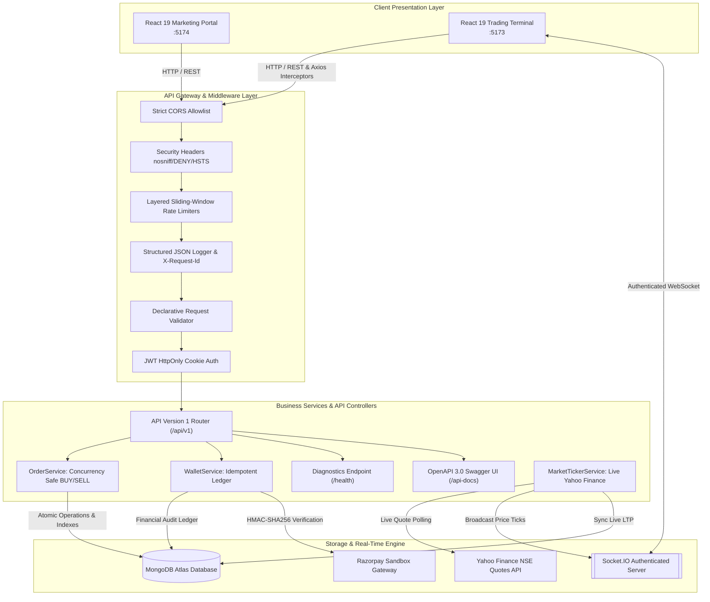
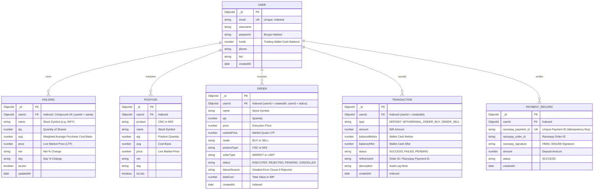

# 📈 PulseTrade — Full-Stack Stock Trading Platform

A production-grade stock trading and portfolio management application built with **Node.js, Express, React 19, WebSockets (Socket.io), MongoDB Atlas, Razorpay Sandbox, and Docker**.


---

## 🏛️ System Architecture



---

## 🗄️ Database Entity-Relationship (ER) Diagram



---

## 🚀 Key Features

- 💹 **Real-Time Stock Market Data**: Streaming live market price updates from Yahoo Finance API via WebSockets (`socket.io`) with JWT handshake authentication.
- 💼 **Transaction-Safe Order Execution**:
  - Atomic BUY order balance deductions (`{ funds: { $gte: totalCost } }`) eliminating double-spending race conditions.
  - Atomic SELL deductions (`{ qty: { $gte: qty } }`) eliminating overselling.
  - Automatic weighted average cost basis calculations (`avgCostBasis` vs `marketPrice` vs `executionPrice`).
  - Order state machine (`PENDING`, `EXECUTED`, `REJECTED`, `CANCELLED`).
- 📑 **Orders Pagination, Filtering & Search**:
  - Filter by `status` (EXECUTED / REJECTED), `mode` (BUY / SELL), and stock `symbol`.
  - Sort by date, price, quantity, or total cost (`asc` / `desc`).
  - Structured pagination metadata (`totalOrders`, `totalPages`, `hasNextPage`, `hasPrevPage`).
- 🔒 **Hardened Authentication & Session Security**:
  - Secure JWT session tokens stored exclusively in **`HttpOnly` cookies** with **zero JWT token exposure in JSON responses**.
  - Strict **CORS allowlist enforcement** on REST APIs and Socket.IO connections.
  - Layered sliding-window rate limiters (Global, Auth, Trading Orders, Wallet actions).
  - Production security headers (`nosniff`, `DENY`, `X-XSS-Protection`, `HSTS`).
- 💳 **Razorpay Sandbox Integration with Idempotency**:
  - Cryptographic server-side **HMAC-SHA256 signature verification**.
  - Unique payment ID tracking preventing duplicate crediting from replayed callbacks.
  - Immutable wallet transaction ledger (`TransactionModel`) recording before/after balances.
- 🩺 **System Diagnostics & Observability**:
  - JSON structured logging with correlation `X-Request-Id` and response latency tracking.
  - Rich health check endpoint (`/health` and `/api/v1/health`) reporting DB latency, memory, uptime, and active socket connections.
  - Interactive **OpenAPI 3.0 Swagger UI** documentation at `/api-docs`.
- 🎨 **Responsive Frontend & Modern State UX**:
  - Centralized Axios API client with interceptors and domain services.
  - Polished loading skeleton rows, actionable empty states with CTAs, and error retry banners.
  - Mobile-first responsive layouts with touch-friendly action windows and table scrolling.

---

## 🛠️ Tech Stack

### Frontend & Dashboard
- **React 19** + **Vite**
- **React Router 7**
- **Material UI (@mui/material)** + Custom Design System
- **Chart.js** & **react-chartjs-2**
- **Socket.io Client**
- **Axios Client Interceptors** + **React Toastify**

### Backend API
- **Node.js** & **Express**
- **MongoDB Atlas** with **Mongoose ODM**
- **Socket.io** Authenticated Server
- **Yahoo Finance API (`yahoo-finance2`)**
- **JSONWebTokens (`jsonwebtoken`)** & **bcryptjs**
- **Razorpay SDK** (Cryptographic HMAC-SHA256 Auditing)
- **OpenAPI 3.0 & Swagger UI**

### DevOps & Infrastructure
- **Docker** & **Docker Compose**
- **GitHub Actions** (Full-Stack CI Pipeline)
- **Jest** & **Supertest** (Real MongoDB Integration Testing)

---

## 📡 API Endpoints (Version 1: `/api/v1`)

| Method | Primary Endpoint | Legacy Alias | Description | Auth Required | Rate Limited |
|---|---|---|---|:---:|:---:|
| `GET` | `/api/v1/health` | `/health` | System diagnostics & DB ping latency | ❌ | ❌ |
| `GET` | `/api-docs` | `/api-docs` | Interactive OpenAPI 3.0 Swagger UI | ❌ | ❌ |
| `POST` | `/api/v1/auth/signup` | `/signup` | User account registration (sets HttpOnly cookie) | ❌ | 🔒 (20 / 15m) |
| `POST` | `/api/v1/auth/login` | `/login` | User login & HttpOnly cookie issuance | ❌ | 🔒 (20 / 15m) |
| `POST` | `/api/v1/auth/logout` | `/logout` | User logout & cookie clearance | ❌ | ❌ |
| `POST` | `/api/v1/auth/` | `/` | User session verification | 🔑 | ❌ |
| `GET` | `/api/v1/orders/allOrders` | `/allOrders` | Fetch user orders (supports page, limit, status, mode, symbol, sort) | 🔑 | ❌ |
| `POST` | `/api/v1/orders/newOrders` | `/newOrders` | Submit transaction-safe BUY / SELL stock order | 🔑 | 🔒 (30 / 1m) |
| `GET` | `/api/v1/holdings/allHoldings` | `/allHoldings` | Retrieve user stock holdings | 🔑 | ❌ |
| `GET` | `/api/v1/holdings/allPositions` | `/allPositions` | Retrieve user active positions | 🔑 | ❌ |
| `POST` | `/api/v1/holdings/seedDemoData` | `/seedDemoData` | Seed ₹50,000 demo portfolio | 🔑 | ❌ |
| `DELETE` | `/api/v1/holdings/resetPortfolio` | `/resetPortfolio` | Reset portfolio and funds to clean state | 🔑 | ❌ |
| `GET` | `/api/v1/wallet/user/funds` | `/user/funds` | Fetch available cash margin & total funds | 🔑 | ❌ |
| `POST` | `/api/v1/wallet/user/funds` | `/user/funds` | Deposit or withdraw funds from wallet | 🔑 | 🔒 (15 / 1m) |
| `POST` | `/api/v1/wallet/create-razorpay-order` | `/create-razorpay-order` | Create Razorpay test order | 🔑 | 🔒 (15 / 1m) |
| `POST` | `/api/v1/wallet/verify-razorpay-payment` | `/verify-razorpay-payment` | Verify HMAC-SHA256 signature with idempotency | 🔑 | 🔒 (15 / 1m) |
| `GET` | `/api/v1/wallet/user/transactions` | `/user/transactions` | Retrieve wallet audit transaction ledger | 🔑 | ❌ |

---

## 💻 Local Development Setup

### 1. Clone the repository
```bash
git clone https://github.com/Sekhar01807/Trading-platform.git
cd Trading-platform
```

### 2. Configure Environment Variables
Copy `.env.example` in `Backend/` to `.env`:
```bash
ATLASDB_URL=mongodb+srv://...
TOKEN_KEY=your_jwt_secret_key
RAZORPAY_KEY_ID=rzp_test_...
RAZORPAY_KEY_SECRET=...
FRONTEND_URL=http://localhost:5174
DASHBOARD_URL=http://localhost:5173
```

### 3. Start Services

#### Run Backend API:
```bash
cd Backend
npm install
npm run dev   # Development mode with nodemon
# or npm start for production mode (node index.js)
```
- **API Health**: `http://localhost:3000/health`
- **Swagger Docs**: `http://localhost:3000/api-docs`

#### Run Dashboard:
```bash
cd dashboard
npm install
npm run dev
```

#### Run Frontend Marketing Portal:
```bash
cd frontend
npm install
npm run dev
```

---

## 🧪 Running Automated Tests

Run the real MongoDB integration test suite:
```bash
cd Backend
npm test
```
